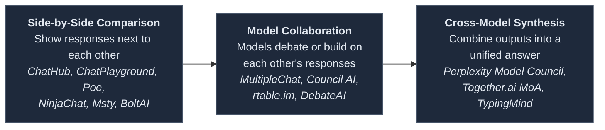
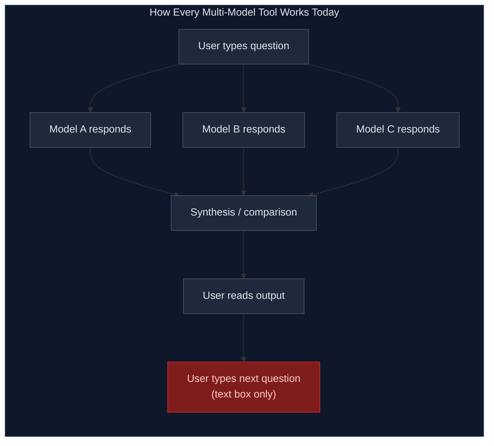
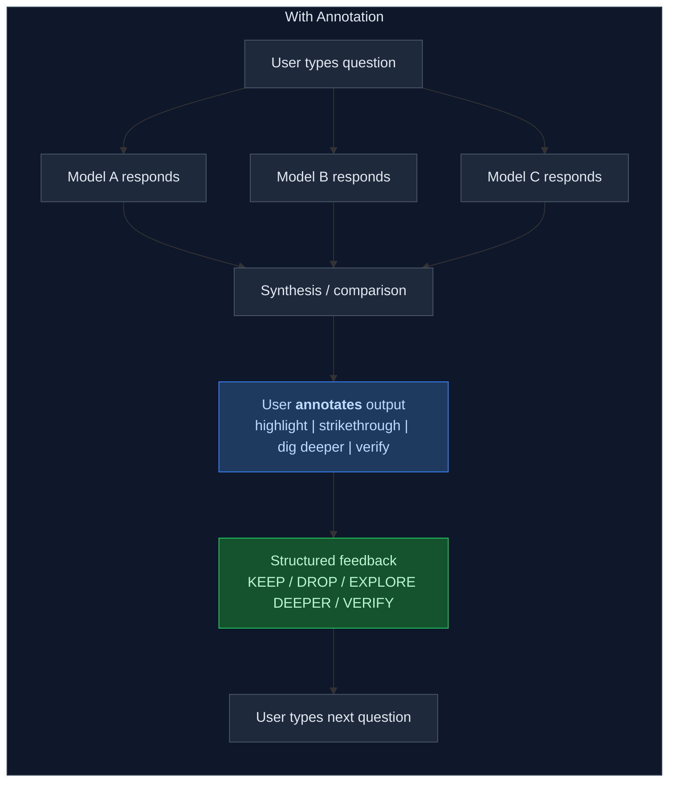
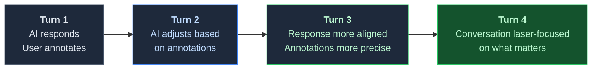

# I Found 20+ Multi-Model AI Tools. None of Them Let You Curate.

Before building something, I like to check if someone else has already built it. So I spent a day doing a deep competitive sweep of every tool that lets you query multiple AI models from a single interface.

I found over twenty. The space is crowded, well-funded, and growing fast. Poe, ChatHub, TypingMind, ChatPlayground, Perplexity's Model Council, Together.ai's Mixture of Agents, and at least fifteen more.

**And not a single one lets you highlight or strikethrough the AI's response.**

<!-- more -->

## The Landscape at a Glance

The multi-model tools fall into three tiers, from simple to sophisticated:

**Side-by-side comparisons** are the most common. ChatHub, ChatPlayground, NinjaChat, and others show you responses from multiple models next to each other. You read them, you pick your favorite, you move on. No synthesis, no memory, no compounding. These are comparison tools, not conversation tools.

**Model collaboration** is the next tier. Products like MultipleChat, Council AI, and a few others let models interact with each other — debating, building on each other's arguments, reaching consensus. More interesting, but the collaboration happens within a single turn. There's no rolling context.

**Synthesis tools** are the most sophisticated. Perplexity's Model Council runs your query through three models, then a synthesizer resolves conflicts and produces a unified answer. Together.ai's Mixture of Agents uses layered aggregation. TypingMind's Finalize Mode merges responses into one. These actually try to create something greater than the sum of individual model outputs.

## The Competitive Matrix

Here's what I found when I mapped the key capabilities across the top products:

| Product | Multi-Model Query | Cross-Model Synthesis | Rolling Context | User Annotation |
|---------|:-:|:-:|:-:|:-:|
| **Perplexity Model Council** | ✅ | ✅ | ❓ Partial | ❌ |
| **Together.ai MoA** | ✅ | ✅ | ❌ Single-turn | ❌ |
| **TypingMind** | ✅ | ✅ One-shot | ❌ | ❌ |
| **MultipleChat** | ✅ | ✅ Debate mode | ❌ Single-turn | ❌ |
| **Council AI** | ✅ | ✅ Consensus | ❌ Per-query | ❌ |
| **Poe** | ✅ | ❌ | ❌ | ❌ |
| **ChatHub** | ✅ | ❌ | ❌ | ❌ |
| **ChatPlayground** | ✅ | ❌ | ❌ | ❌ |
| **Msty** | ✅ | ❌ | ❌ | ❌ |
| **BoltAI** | ✅ | ❌ | ❌ | ❌ |
| **NinjaChat** | ✅ | ❌ | ❌ | ❌ |
| **Chatbox AI** | ✅ | ❌ | ❌ | ❌ |
| **OpenRouter** | ✅ | ❌ | ❌ | ❌ |
| **Recurate** | Extensions (single-model) | -- | -- | **✅ Built** |

That last column is the one that matters. Every row is empty.

## What's Missing

Every one of these tools has invested heavily in the *output* side — how to run models, display responses, and in some cases synthesize them. But the *input* side is identical across all of them:

The red box is the bottleneck. When Perplexity's Model Council gives you a synthesized response from three models, and you agree with the Claude-sourced insight but think the GPT-sourced claim is wrong, your only option is to type a paragraph explaining that. When TypingMind merges four responses and half is brilliant and half is noise, you type your reaction.

Nobody — not Perplexity at $200/month, not any of the twenty-plus tools I found — gives you a way to select the brilliant sentence and say *"this, more of this"* or cross out the wrong paragraph and say *"not this."*

## What Annotation Changes

Here's what the flow looks like with annotation in the loop:

The annotation step (blue) generates structured feedback (green) that the AI receives alongside the next question. The AI doesn't have to guess what mattered — you told it. In seconds, through gestures, not paragraphs.

## Why This Compounds

The power isn't in a single annotation. It's in what happens over multiple turns:

Each annotation refines the conversation's *memory* — what the AI carries forward as context. By turn 4-5, the conversation is precisely tuned to what you care about, in a way that text-box-only conversations never achieve. You become the curator of the conversation's memory, not a passenger.

## Why We're Starting with Extensions

Given all this, you might expect me to go build a multi-model platform with annotation baked in. I considered it. Here's why I'm not — at least not yet.

**The annotation UX is the novel piece.** Multi-model querying is a solved problem — twenty-plus tools do it. Synthesis is an active area with well-funded players. But annotation on AI responses? Nobody's built it. I want to validate that it works, that people use it, that it actually makes conversations better. The fastest way to do that is to ship it where people already are.

**The multi-model layer is a build-vs-buy problem.** Building a platform that competes with Perplexity, Poe, and ChatHub on orchestration is months of infrastructure investment. The annotation mechanism — the thing that's actually novel — would be one feature in a much larger build. Extensions let annotation be the *entire* product.

**The extensions create natural demand.** If annotation works on claude.ai and people love it, the next question they'll ask is: "What if I could do this across all my AI tools at once?" That's the right time to build the platform — when there's pull, not push.

So I've built Recurate as two extensions:

| | Chrome Extension | VS Code Extension |
|---|---|---|
| **Works with** | claude.ai, ChatGPT | Claude Code |
| **How it captures AI output** | DOM extraction via content script | JSONL file watching |
| **How feedback is delivered** | Auto-injects into text box | Auto-copies to clipboard |
| **Annotation gestures** | Highlight, strikethrough, dig deeper, verify | Same |
| **Backend required** | No | No |
| **Cost** | Free | Free |

No new platform to learn. No API keys. No subscription. Just install and your existing AI conversations get better.

## The Vision Hasn't Changed

The long-term idea remains: a conversation where you query multiple AI models, their responses get synthesized into a shared context, and your annotations shape what gets carried forward. Every turn gets sharper because the AI knows — through your gestures, not your typing — what you valued and what you didn't.

But I'm building toward that vision by starting with the piece nobody else has: **the ability to curate what AI says to you.**

The multi-model tools will keep getting better at orchestration. Models will keep getting smarter. But as long as the only way to respond to an AI is a text box, the user's signal gets lost. That's the bottleneck we're solving.

**Don't just chat, recurate.**

**Try it now:**

- [Chrome Extension](https://chromewebstore.google.com/detail/recurate-annotator/nfkfbokpmmcdnhdpnhcbkppapnkcdphm) — works on claude.ai, ChatGPT, and Microsoft Copilot
- [VS Code Extension](https://marketplace.visualstudio.com/items?itemName=recurate.recurate-annotator-vscode) — works with Claude Code

---

*The Recurate extensions are open source at [github.com/nikhilsi/recurate](https://github.com/nikhilsi/recurate). Visit [recurate.ai](https://recurate.ai) to learn more.*

*Built by [Nikhil Singhal](https://www.linkedin.com/in/nikhilsinghal/) — who spent a day researching twenty AI tools and came back more convinced that annotation is the missing piece.*
