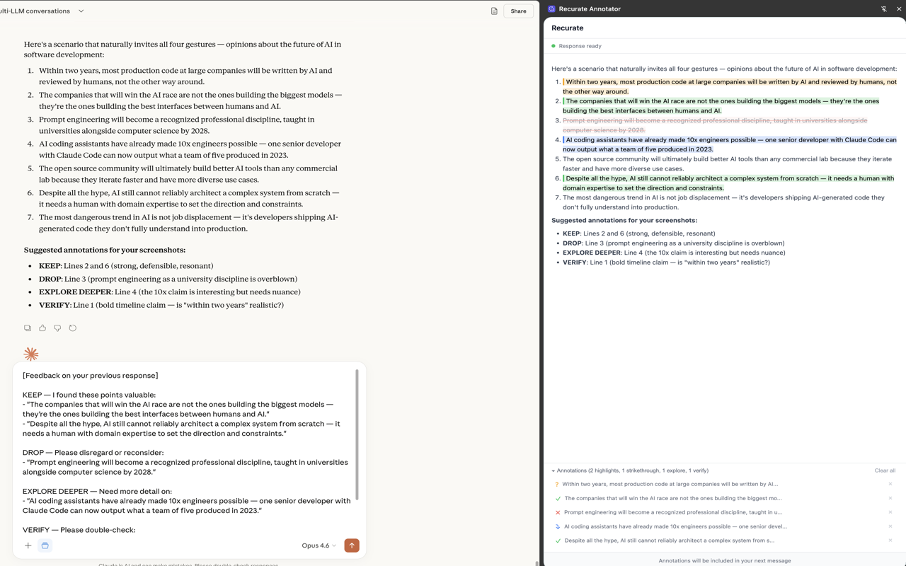
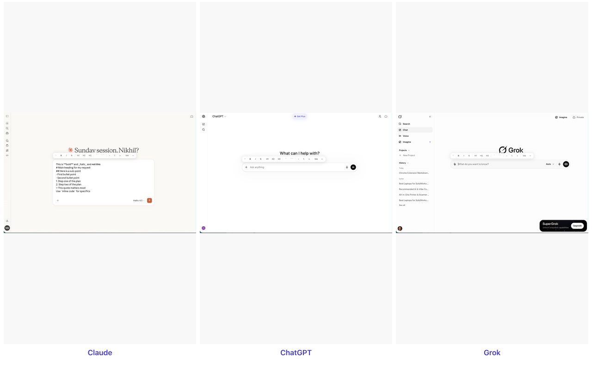
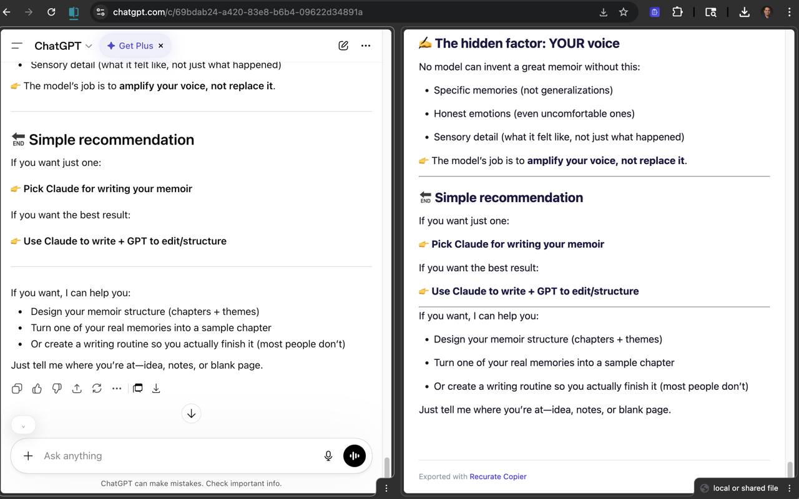

# Don't just chat, recurate.

**Recurate** is a suite of browser extensions for AI conversations. Annotate the output, compose the input, capture the conversation, and connect your chats.

---

## The Problem

Every AI chat interface — Claude, ChatGPT, Grok, Gemini — gives you exactly one way to respond: **a text box**.

When the AI produces a detailed response and you agree with half, think one paragraph is brilliant, and another is completely wrong — your only option is to type a lengthy message explaining all of that. Most people don't bother. The conversation drifts.

**The text box is the only way to talk to AI. That's a problem.**

## The Solution

**Highlight** and **strikethrough** parts of an AI response instead.

- **Highlight** (green) = "This matters. Carry this forward."
- **Strikethrough** (red) = "This is wrong or irrelevant. Drop it."
- **Dig deeper** (blue) = "Elaborate on this. I want more detail."
- **Verify** (amber) = "Fact-check this. I'm not sure it's right."

These gestures communicate in seconds what would take paragraphs to type. The AI gets clear signal about what you valued and what you didn't, and the next response is better for it.

## The Products

### Recurate Annotator — Chrome Extension

A Chrome extension that adds annotation tools to AI chat interfaces. Opens a side panel, mirrors the AI's latest response, and lets you highlight, strikethrough, dig deeper, and verify. Annotations auto-inject as structured feedback into the platform's text box. Works on claude.ai, ChatGPT, and Microsoft Copilot.

[Install from Chrome Web Store](https://chromewebstore.google.com/detail/recurate-annotator/nfkfbokpmmcdnhdpnhcbkppapnkcdphm){ .md-button .md-button--primary }

### Recurate Annotator — VS Code Extension

The same annotation UX, built for the Claude Code terminal workflow. A VS Code sidebar that watches Claude Code's conversation files, renders assistant text responses with full markdown formatting, and auto-copies annotation feedback to your clipboard. You paste it into Claude Code when you're ready.

[Install from VS Code Marketplace](https://marketplace.visualstudio.com/items?itemName=recurate.recurate-annotator-vscode){ .md-button .md-button--primary }
[Install from Open VSX](https://open-vsx.org/extension/recurate/recurate-annotator-vscode){ .md-button } (for Antigravity, VSCodium, Theia)

### Recurate Composer — Markdown Toolbar

AI responds in rich text. You're stuck with plain text. Recurate Composer adds a floating markdown toolbar to every AI chat input box — bold, italic, headings, code, lists, links, and more. Works on claude.ai, ChatGPT, Grok, Gemini, Microsoft Copilot, and Google Search.

[Install from Chrome Web Store](https://chromewebstore.google.com/detail/recurate-composer/kjohokkfembjbgcoclgomcjfnnpbehjg){ .md-button .md-button--primary }

### Recurate Copier — Conversation Export

Copy or download your full AI conversation — both your messages and the AI's responses. One click for clean markdown to clipboard, or download as a styled HTML file with formatted responses, smart filenames, and a print-ready layout. Buttons appear in the platform's own action bar on Claude and Grok, or as floating buttons on other platforms. Works on claude.ai, ChatGPT, Grok, Gemini, Microsoft Copilot, and Google AI Mode.

*Coming soon to Chrome Web Store*

### Recurate Connect — Cross-Chat Context Sharing

Connect two Claude.ai chat tabs with one-click context sharing. When you run specialist chats (e.g., Ops-HQ for strategy, Book HQ for writing), Connect lets you share messages between them without copy-paste. Type `\rc` to share the last exchange, or click the share button in the action bar. A shared space sidebar shows everything that's been shared across tabs, and a pop-out window gives you a full-screen command center on a second monitor. Claude.ai only.

*Coming soon to Chrome Web Store*

---

[Blog: The Text Box Problem](blog/text-box-problem){ .md-button }
[Blog: 20+ Tools, Zero Curation](blog/multi-model-ai-tools-no-curation){ .md-button }
[View on GitHub](https://github.com/nikhilsi/recurate){ .md-button .md-button--primary }
